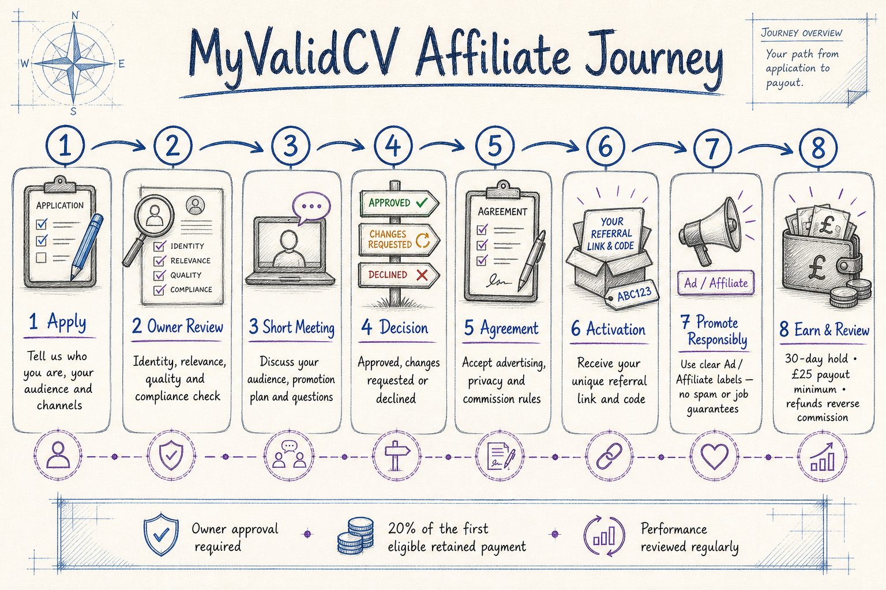

# MyValidCV Affiliate Programme Guide

> Version 1.0 · Owner-approved programme · Prepared 28 August 2026

## Programme at a glance

MyValidCV works with selected creators, career professionals, agencies, universities and employment networks that can introduce the service responsibly to a relevant audience. Applying does not guarantee acceptance. Every affiliate is reviewed by the platform owner, normally attends a short online meeting, accepts the current agreement and receives a unique referral code before promotion begins.

- Standard commission: 20% of the first eligible retained customer payment.
- Attribution window: 30 days after a consented affiliate-link visit, or a code entered manually at checkout.
- Commission hold: 30 days.
- Minimum payout: GBP 25.
- Payment frequency: monthly after approval and threshold checks.
- Refunds, chargebacks, fraud, tax and invalid or self-referred transactions do not earn commission.
- Affiliate activity never guarantees income, interviews or employment.

## Who may apply

### Creators and publishers

Applicants should have at least one established public channel. Around 1,000 genuine followers, subscribers or community members is preferred, but smaller specialist audiences may qualify when their relevance and engagement are strong.

### Institutions and professional networks

Universities, training providers, recruitment or career agencies, advisers, job fairs, charities and public-sector employment services are assessed through student, member, client, mailing-list or event reach rather than follower count.

## Information required in the application

Prepare the following before applying:

1. Full name and account email.
2. Legal or trading name.
3. Applicant type: creator, publisher, adviser, agency, university, job fair, charity, public-sector service or other.
4. Country of establishment and countries where the audience is mainly located.
5. Website and public social-profile links.
6. Audience size for each proposed channel.
7. Typical views, engagement, mailing-list reach or event attendance during the previous 90 days.
8. Audience description, including its connection to careers, education, recruitment or professional development.
9. Channels that will be used: website, blog, email, LinkedIn, YouTube, Facebook, Instagram, TikTok or events.
10. A short description of the planned promotion.
11. Previous affiliate or advertising experience, if any.
12. Confirmation that followers and engagement were not purchased.
13. Confirmation that advertising, privacy, anti-spam and brand rules will be followed.

Never provide social-media passwords, full banking credentials or unnecessary identity documents in the application.

## How applications are assessed

The owner reviews each application consistently:

| Area | Weight | What good evidence looks like |
| --- | ---: | --- |
| Audience relevance | 30% | Job seekers, recruiters, students, graduates or career professionals |
| Content quality and reputation | 20% | Accurate, useful, current and respectful public content |
| Genuine engagement | 20% | Credible views, replies, clicks, attendance or subscriber interaction |
| Compliance readiness | 20% | Clear advertising labels, lawful communications and realistic claims |
| Audience size | 10% | Meaningful reach for the channel and audience type |

Automatic follower-count rejection is not used. False information, fake engagement, spam, discriminatory content, employment guarantees or unsafe data practices may result in rejection.

## The eight-stage journey

### 1. Apply

Submit all requested information and working public links. Incomplete applications may be returned once for clarification. No referral code is active at this stage.

### 2. Owner review

The owner checks identity, audience fit, content quality, reputation, geography, proposed channels and compliance risk. The status becomes one of: `Under review`, `Meeting requested`, `Changes requested`, `Approved` or `Declined`.

### 3. Short online meeting

The normal meeting lasts 15–20 minutes. The applicant should be ready to explain:

- who the audience is and what it needs;
- where and how MyValidCV will be promoted;
- expected posting or campaign frequency;
- how advertisements and affiliate links will be disclosed;
- how mailing consent and opt-outs are managed;
- what claims will be avoided;
- who is authorised to accept the agreement; and
- any questions about tracking, commission or payment.

The meeting is not a sales guarantee. Notes and the outcome are recorded in the partner file.

### 4. Decision

- **Approved:** proceed to the agreement.
- **Changes requested:** provide the missing evidence or amend the promotion plan.
- **Declined:** the application does not currently meet the programme criteria. The owner may state whether reapplication is allowed.

### 5. Agreement

An authorised representative accepts the current version online. The record includes the legal name, country, approved channels, signatory, version and acceptance time. A changed agreement requires acceptance of the new version before continued eligibility.

### 6. Activation

After approval and agreement acceptance, MyValidCV activates a unique link and code:

`https://www.myvalidcv.com/?ref=YOURCODE`

Affiliate-link attribution requires the visitor's separate choice. Visitors who decline tracking may type the referral code manually during checkout. Affiliates must test their link before publishing it.

### 7. Promote responsibly

Every compensated promotion must be immediately recognisable as advertising. Use a prominent label such as `Ad` or `Affiliate` before or at the start of the content. Platform-provided paid-partnership tools should also be used where applicable.

Affiliates must not:

- promise employment, interviews, ATS acceptance or guaranteed results;
- send unsolicited marketing or upload purchased contact lists;
- hide the commercial relationship;
- create fake reviews, accounts, purchases or engagement;
- refer themselves or members of their own partner organisation;
- impersonate MyValidCV or register confusing domains or accounts;
- bid on protected MyValidCV brand terms without written approval;
- alter approved claims in a misleading way;
- collect CVs, passwords, card details or unnecessary personal information for MyValidCV; or
- publish discriminatory, unlawful, unsafe or reputation-damaging material.

When uncertain, pause the content and request written approval before publication.

### 8. Earn, review and receive payment

A commission record is created only after a verified eligible payment. It remains pending during the 30-day hold, then may be approved and released as payable. Payment is recorded only after the affiliate's payable balance reaches GBP 25 and the external payout has been completed.

Refunded, charged-back, fraudulent, duplicated, test or self-referred payments reverse the commission. Partners are responsible for their own tax reporting and for keeping payout and contact information current.

## Performance and quality review

MyValidCV may review:

- clicks, attributed accounts and verified conversions;
- conversion and refund rates;
- traffic quality and unusual patterns;
- approved-channel use;
- disclosure and brand compliance;
- complaints or misleading claims; and
- content accuracy and audience relevance.

The standard first-payment commission remains 20% at launch. Higher rates are not automatic. A separate written approval may be considered after at least three months of genuine, compliant performance.

## Suspension and termination

MyValidCV may pause a code while investigating fraud, complaints, unsafe content, agreement breach or abnormal activity. Serious misconduct may result in immediate termination and commission reversal. Routine termination should follow the notice stated in the accepted agreement. Records required for payments, disputes, fraud prevention and legal obligations may be retained after closure.

## Quick answers

**Does applying guarantee approval?** No.

**Do I need 1,000 followers?** It is preferred for creators, but relevance and genuine engagement can justify an exception. Institutions are assessed by their actual reach.

**Can I use my own code?** No.

**Can I email my audience?** Only when you have a lawful basis, provide required information and honour opt-outs. Purchased or scraped lists are prohibited.

**When do I earn commission?** After a referred customer makes the first eligible verified payment and it survives the hold period.

**Why was commission reversed?** Common reasons are a refund, chargeback, fraud, duplicate/test activity, self-referral or agreement breach.

**Can I promise that MyValidCV will get someone a job?** No. The service provides application guidance and does not guarantee hiring outcomes.

**Who handles support?** Programme and account questions go to support@myvalidcv.com. Affiliates should not handle customer CV, payment or privacy data themselves.

## Owner approval checklist

- Application is complete and links work.
- Identity or organisational authority is reasonably verified.
- Audience and geography are relevant.
- Engagement appears genuine.
- Proposed channels are recorded.
- Advertising and direct-marketing obligations are understood.
- No material reputation, fraud or content concerns remain.
- Online meeting notes and decision are recorded.
- Commission rate, attribution period, hold and payout threshold are confirmed.
- Current agreement is accepted by an authorised person.
- Referral code is unique, tested and activated only after every preceding check.

This operational guide does not replace legal or tax advice. The affiliate agreement and programme terms should be reviewed by a qualified UK adviser before public self-registration opens.
